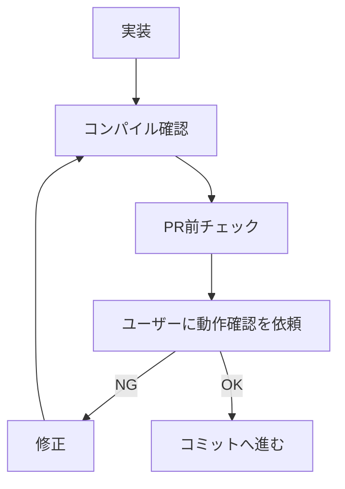

# 開発フロー（実装後に何を回すか）

テストを書くかどうかの判断は `rules/testing.md`、Unity 操作は `rules/unity-cli.md` が正本。
ここは「どの変更にどの検査を当てるか」だけを持つ。

## PR 前チェック

下表の該当行を実行する。どの行にも該当しない変更（コメント・typo・ドキュメントのみ等）は
本節のチェックを要しない。複数行に該当するならすべて実行する。

| 変更内容 | 実行するチェック |
|:---|:---|
| **plain class** の `.cs` 変更（Domain / Application / Infrastructure / Shared、および Presentation の Model / Manager / Provider） | `rules/testing.md` に従いテスト要否を判定し、必要なら追加/更新して差分のスコープで実行する |
| **MonoBehaviour / UXML / シーン依存**の `.cs` 変更（View / Binder / Presenter / `*LifetimeScope`） | コンパイル確認（`rules/unity-cli.md`）→ 下記「ランタイム動作確認」 |
| `/lint-unity` が対象とする拡張子の変更 | `/lint-unity` + コンパイル確認（`rules/unity-cli.md`） |

対象拡張子の一覧は `/lint-unity` skill が正本。ここへ書き写さない
（`.cs` / `.uxml` / `.uss` / `.json` / `.md` は lint の対象外なので、これらだけの変更で起動しない）。

### 実行順序

1. **`/code-review`** を実行する場合は、コードを修正しうるため最初に実行する
2. テスト実行 → **`/lint-unity`** の順（どちらも Unity Editor を使うため逐次実行）

## ランタイム動作確認

MonoBehaviour・UXML・シーンに依存する部分はランタイム挙動の自動テストが困難なため、
ユーザーによる動作確認を挟む。**自動テストの追加はこの手動確認の代替ではない** —
Presentation の plain class をテストしても UXML 配線・レイアウト・見た目は守れないので、どちらも必要。

- 試行錯誤中はコミットせず、ユーザーの OK 後にコミットする
- 修正中の変更は unstaged のまま重ねてよい

## 完了報告

実装完了時に以下を報告する。

- 変更した層
- テスト追加/更新の有無
- 追加/更新した場合: **各テストが落ちる具体的な実装改変**（どの条件式・代入をどう変えると落ちるか）
- 追加しない場合: なぜ不要か。既存テストで十分ならその理由
- 削除を提案した既存テストの一覧と根拠
- 実行した検証（コンパイル確認 / テスト実行 / `/lint-unity` / 手動確認依頼）
- 残る手動確認事項
