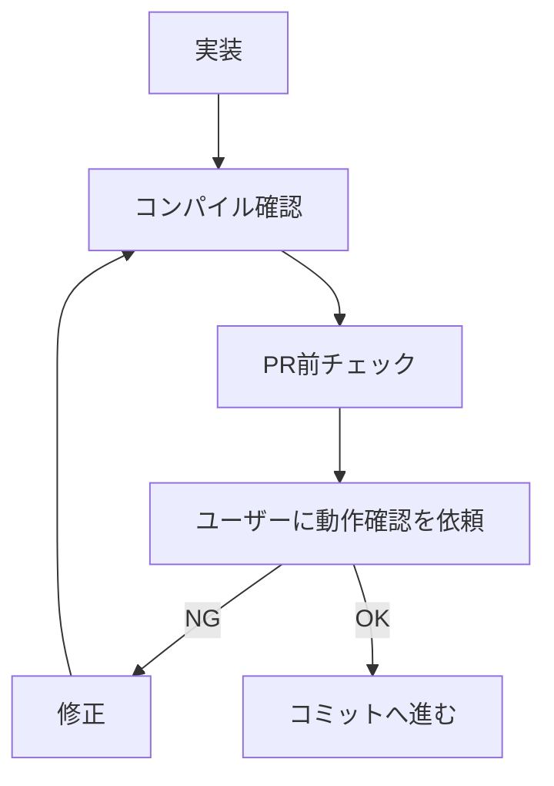

# テスト・検証方針

## 自動実行ルール

- 実装後は `rules/unity-mcp.md` の「コンパイル確認」手順で、コンパイル完了を待ってエラーがないことを確認する
- テスト実行は必ず `/test-unity` スキル経由で行う（バインディング表の「テスト実行」を直接呼ばない）

## テスト責任

Claude は実装後、ユーザーから明示されていなくても変更差分ごとにテスト要否を判断する。
テストが必要な変更では意味のあるテストを追加・更新し、不要な変更では理由を明記する。

以下の変更では、原則としてテスト追加または既存テスト更新を行う:
- Domain / Application / Shared のロジック変更
- UseCase の成功/失敗分岐、状態更新、rollback / fallback、エラー変換、呼び出し順序、キャンセル伝播の変更
- Infrastructure の DTO 変換、URL / path / header 組み立て、レスポンス解釈、エラーコード変換、認証情報の扱いの変更

以下の変更では、テスト不要と判断してよい。ただし完了報告に理由を記載する:
- Presentation の見た目・配置・Inspector 配線のみの変更
- コメント、XML summary、typo、README 等のドキュメントのみの変更
- enum / DTO / record / struct の単純な項目追加で、ロジックを伴わない変更
- 既存テストが変更後の仕様をすでに十分にカバーしている変更
- Unity ランタイム、SDK、外部サービス、実機操作に強く依存し、自動テストより手動確認が適切な変更

## 禁止する低品質テスト

以下のみを検証するテストを追加してはならない:
- `Assert.Pass()`
- 単なる constructor / `IsNotNull` / `CreatesInstance`
- 単なる `DoesNotThrow`
- DTO / record / struct の getter / setter 代入確認だけのテスト
- データ保持型の constructor 引数が同名プロパティに入るだけのテスト
- service / SDK wrapper の初期値だけを確認し、実際の振る舞い・エラー変換・状態遷移を守らないテスト
- 実装と同じ分岐をなぞるだけで仕様を表していないテスト
- private 実装詳細に依存した壊れやすいテスト
- 仕様語（「正しく」等）を主張するが、それを観測する assertion を持たないテスト（fake assertion）
- 下位 UseCase の単体テストで既出の結果 state を、合成クラス（Orchestrator）テストで再検証するだけのテスト

テストを追加する場合は、失敗時にユーザー価値・仕様・回帰リスクのいずれかを説明できる内容にする。
初期値テストは、Application State / UI Model など外部から購読される状態の初期契約を守る場合に限る。

## テストスタブ

テストスタブ（Stub / Spy / Fake）は `Tests/EditMode/TestDoubles/` 配下（context 別サブフォルダ）に
共有定義する。同一 interface のスタブを各テストファイル内の private nested クラスとして
重複定義しない。

## 既知失敗テスト

外部アセット欠落等の理由で**全件実行時に常に失敗する既知のテスト**があればここに記録し、
green/red 判定はそれを除外して（またはプロジェクトのテスト assembly に限定して）行う。

- 現在: なし

## PR 前チェック

下表の該当行のチェックを実行する。いずれの行にも該当しない変更（コメント・typo・
ドキュメントのみ等）は本節のチェックを要しない。

| 変更内容 | 実行するチェック |
|:---|:---|
| Domain / Application / Infrastructure の `.cs` 変更 | `/test-unity`（テスト責任の判定 + 必要なテスト追加/更新 + 実行） |
| Presentation の `.cs` 変更 | コンパイル確認（`rules/unity-mcp.md`）→ ユーザー動作確認 |
| 下記「lint 対象拡張子」の変更 | `/lint-unity` + コンパイル確認（`rules/unity-mcp.md`） |

複数行に該当する場合は該当するチェックをすべて実行する。

### lint 対象拡張子

`.unity` / `.prefab` / `.asset` / `.mat` / `.anim` / `.controller` / `.shader` / `.shadergraph` / `.hlsl` / `.vfx` / `.renderTexture` / `.playable` / `.asmdef` / `.png` / `.jpg` / `.tga` / `.exr` / `.wav` / `.mp3` / `.ogg`

**対象外**: `.cs` / `.uxml` / `.uss` / `.json` / `.md` / `.txt` 等。これらに対しては `/lint-unity` を起動しない。

### 実行順序

1. **`/code-review`** を実行する場合は、コードを修正しうるため最初に実行する
2. **`/test-unity`** → **`/lint-unity`** の順に実行（両スキルとも Unity MCP を使用するため逐次実行）

## Presentation層の動作確認フロー

Presentation層はランタイム挙動の自動テストが困難なため、ユーザーによる動作確認を挟む。

- 試行錯誤中はコミットせず、ユーザーの OK 後にコミットする
- 修正中の変更は unstaged のまま重ねてよい

## 完了報告

Claude は実装完了時に以下を報告する:
- 変更した層
- テスト追加/更新の有無
- テストを追加/更新した場合: 何の仕様・回帰を守るテストか
- テストを追加しない場合: なぜ不要か、既存テストで十分ならその理由
- 実行した検証（compile / `/test-unity` / `/lint-unity` / 手動確認依頼）
- 残る手動確認事項
