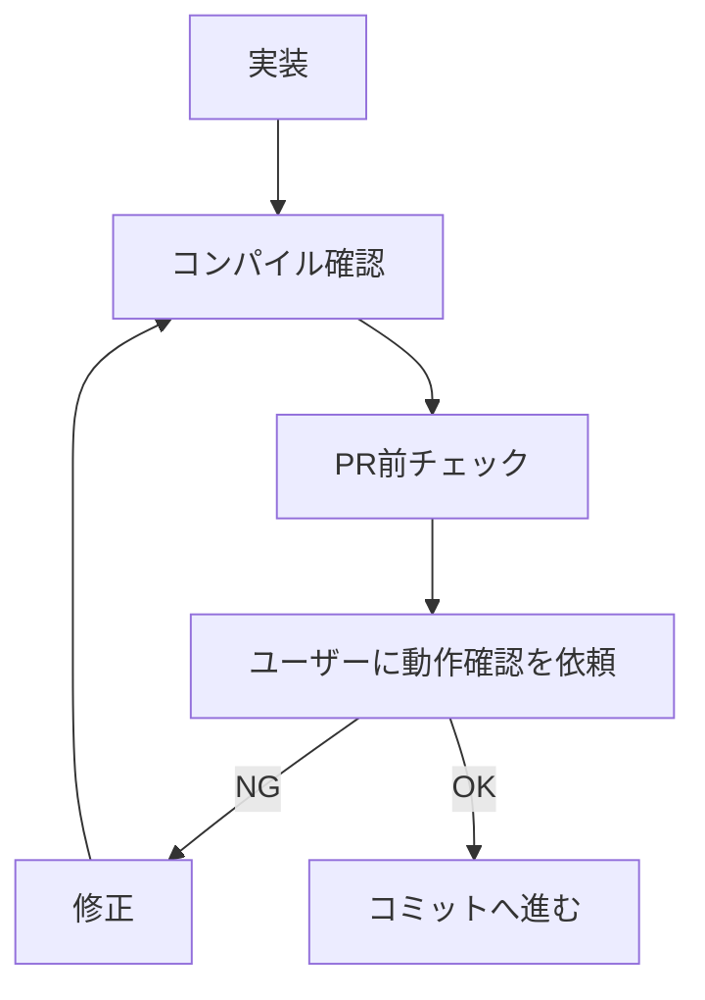

# テスト・検証方針

## 大原則

1. **テストは仕様（観測可能な振る舞い）を守る安全網である。** 実装をなぞる写経ではない
2. **書きすぎない。** AI はテストを量産しがちで、低価値テストは保守コストだけ増やす。
   「このテストだけが殺せる回帰」を 1 文で言えないテストは追加しない

判断の詳細は 2 つの参照ガイドが持つ。

- **何をテストするか**（技法・依存エラー方針・合成クラス・無効同値）→ `references/test-designing-guide.md`
- **どう書くか**（命名・NUnit/UniTask 規約・TestDoubles・asmdef）→ `references/test-writing-guide.md`

## 自動実行ルール

- 実装後は `rules/unity-cli.md` の「コンパイル確認」手順で、コンパイル完了を待ってエラーがないことを確認する
- 変更差分に対応するテストは実装した本人が回す（`unity test --mode EditMode --filter <名前空間>`）。
  全件実行は CI（`.github/workflows/unity-ci.yml`）が担うので、ローカルで全件を回さない

## テスト層

自動テストは **EditMode の単体 / ロジックテストに限定**する。

- 検証するのは「メソッドの直接呼び出しで起動する振る舞い」（純ロジック・状態遷移・エラー変換等）
- PlayMode / 統合テスト / 視覚検証は**自動スイートで扱わない**。ランタイム挙動・見た目は
  ユーザー手動確認へ委譲する（下記「ランタイム動作確認フロー」）
- 選別は **Unity ランタイム依存の有無**で決める。MonoBehaviour に純ロジックが埋まっている場合は、
  テストをこじ開けるのでなく plain class への分離を提案する（下記「テスタビリティ」）

## テスト責任

Claude は実装後、ユーザーから明示されていなくても変更差分ごとにテスト要否を判断する。
**判定は層名ではなく「plain class か、Unity ランタイムに依存するか」で行う。**
報告の書き方は本ファイル「完了報告」が単一ソース（追加した場合・しなかった場合のどちらもそこに従う）。

以下の変更では、原則としてテスト追加または既存テスト更新を行う:
- Domain / Application / Shared のロジック変更
- **Presentation の plain class**（Model / Manager / Provider 等）の値域制約・導出・状態遷移・入力正規化・Clear 処理の変更
- UseCase の状態更新、rollback / fallback、呼び出し順序、キャンセル伝播の変更
- 失敗分岐のうち、**固有の**エラー変換・状態巻き戻し・副作用を持つものの変更
- Infrastructure の DTO 変換（型変換・単位変換・欠損値 fallback を含むもの）、URL / path / header 組み立て、レスポンス解釈、**外部由来**のエラーコード変換、認証情報の扱いの変更

以下の変更では、テスト不要と判断してよい:
- Presentation の見た目・配置・Inspector 配線を含む変更（ランタイム挙動はユーザー手動確認）
- View / Binder / Presenter の変更（Presenter に配線以上のロジックが入ったら、テストではなく Model への切り出しで対応する）
- コメント、XML summary、typo、ドキュメントの変更
- enum / DTO / record / struct の項目追加と、その素通しのマッピング追加
- 単一依存の失敗をそのまま転送する経路、転送のみの facade / パススルー
- context 境界をまたぐ内部 enum の再マッピング（外部由来の入力を注入する経路ではない）
- 既存テストが変更後の仕様をカバーしている変更
- Unity ランタイム、SDK、外部サービス、実機操作に依存し、手動確認のほうが適切な変更

**両方のリストに該当する変更では、下記「禁止する低品質テスト」を優先する。**
例: DTO に項目を 1 つ足して 1 対 1 でマッピングする変更は「DTO 変換」に見えるが、
書けるテストの実体は禁止リストの代入確認なので追加しない。

## 禁止する低品質テスト

以下のみを検証するテストを追加してはならない。**既存テストがこれに該当する場合は削除を提案する**
（追加時のフィルタだけでは蓄積し、しかも「既存テストで十分」判定の材料に化ける）:
- `Assert.Pass()`
- 単なる constructor / `IsNotNull` / `CreatesInstance`
- 単なる `DoesNotThrow`
- DTO / record / struct の getter / setter 代入確認だけのテスト
- データ保持型の constructor 引数が同名プロパティに入るだけのテスト
- 同型同名フィールドをコピーするだけの変換を assert するテスト（型変換・単位変換・欠損値 fallback を伴うフィールドのみ assert する）
- **スタブに仕込んだ値がそのまま返ることを確認するテスト**（SUT が転送しかしていない場合。恒等写像の確認になる）
- 初期値だけを確認し、実際の振る舞い・エラー変換・状態遷移を守らないテスト（例外は下記の初期契約）
- **外部購読される状態の初期値を、プロパティごとに 1 メソッドずつ確認するテスト**（初期契約は 1 メソッドにまとめる）
- 実装と同じ分岐をなぞるだけで仕様を表していないテスト
- エラー enum の 1 対 1 対応表を全要素列挙して写すだけのテスト
- private 実装詳細に依存した壊れやすいテスト
- 仕様語（「正しく」等）を主張するが、それを観測する assertion を持たないテスト（fake assertion）
- 下位の単体テストで既出の結果 state を、合成側のテストで再検証するだけのテスト

テストを追加する場合は、失敗時にユーザー価値・仕様・回帰リスクのいずれかを説明できる内容にする。
初期値テストは、外部から購読される状態の初期契約（購読側が初期値に依存して表示・分岐を決める）を守る場合に限り、
プロパティをまとめて 1 メソッドで検証する。

## 追加前ゲート

追加候補ごとに **4 つすべて**満たすか確認する。1 つでも満たせないものは追加しない。

### 1. 回帰特定
そのテストが**落ちる具体的な実装改変を 1 つ挙げられる**こと（どのメソッドのどの条件式・どの代入を
どう変えると落ちるか）。挙げられないなら追加しない。

「仕様を守るテストです」「正しく動くことを確認します」は説明ではない。**改変を名指しできるか**で判定する。

### 2. 一意性
**重複** = 別テストと同じ実装箇所の同じ回帰を殺している。ゲート 1 で挙げた改変が既存テストも
落とすなら、字面が違っても重複であり追加しない。

- 同一のガード実装を、公開 API の数だけ反復しない。残すのは最も上位の入口 1 件
- 入力値だけが違う再確認はパラメータ化で 1 メソッドに集約する
- 同一 condition のテストを multi-assert に統合しない（1 ケース 1 検証）。
  例外は「状態遷移後に複数プロパティが同時に正しくある必要がある場合」と「初期契約」

### 3. 仕様語 ↔ assertion 整合
意図やコメントに**仕様語**（順序 / rollback / fallback / エラー変換 / 状態遷移 / キャンセル伝播）が
出るなら、それを**実際に観測する assertion** が存在すること。

検証内容には**観測可能な性質だけ**を書く。なぜ存在するか（rationale）・テスト機構・入力の構築手順を
混ぜない。混ぜたものは fake assertion の温床になる。

### 4. テストダブルの語彙
検証したいのが「呼ばれたか・順序」なら **spy**、「SUT を動かすため」なら **stub / fake**。
stub / fake は arrange の関心事なので検証意図に書かない。不要なダブルを増やさない。

## 重複整理（書いた後に必ず通す）

テストを書いた後、追加・変更したファイルと同一テストクラスの既存テストを読み直す。

- **重複**（ゲート 2 の定義）→ より正確な名前のものを残し、他を削除
- **パラメータ化マージ** — condition が違っても「引数だけが違い、同一同値区分で同一の期待結果」なら
  1 メソッドへ統合する。本体に `if` / `switch` を書かない。**期待値をパラメータ化しない**
  （期待値が分岐するなら別区分 ＝ 別テスト）
- **禁止リスト該当の既存テスト**を見つけたら削除を提案する

この段は「AI がテストを書きすぎる」傾向への構造的な歯止め。書いた直後に必ず通す。

## テスタビリティ

「テストが書きにくい」と感じたら、それは**テストの問題ではなく対象コードの設計問題**の兆候。
以下のいずれかなら、無理にテストをこじ開けず設計見直しを報告する
（`rules/coding-standards.md`「設計アプローチ」に従う）。

- 単体テストの境界が引けない（SUT が大きすぎる）
- 状態が隠蔽され外部から観測できない
- 条件数に対しテストケースが O(n) より速く増える（組合せ爆発）
- 依存が注入できない（static / global 結合、constructor 内 `new`）
- MonoBehaviour に純ロジックが埋まっていて分離されていない

## テストスタブ

テストスタブ（Stub / Spy / Fake）は `Tests/EditMode/TestDoubles/` 配下（context 別サブフォルダ）に
共有定義する。同一 interface のスタブを各テストファイル内の private nested クラスとして
重複定義しない。

## テスト実行のスコープ

**全件実行は CI が行う**（`.github/workflows/unity-ci.yml` の test ジョブ）。ローカルの
ローカルでは変更差分に対応するテストだけ回す。同じ全件実行を 2 箇所で走らせない。

外部アセット欠落等でプロジェクト外のテストが常に失敗する場合、CI 側で絞る。
workflow の `TEST_FILTER` に**プロジェクト自身のテスト名前空間**を書く
（`--filter` は選択であって除外ではないので、消したいものではなく残したいものを書く）。
値の正本は workflow の 1 箇所だけ。ここへ書き写さない。

**`--filter` が 0 件マッチでも exit 0 が返る。** 名前空間をリネームすると偽の緑になるので、
ローカルでも CI でも実行件数を確認し、0 件なら緑と扱わない。

不安定なテストは一覧で管理しない。`unity test --retries <n>` がリトライで通ったものを
**flaky** として報告するので、その報告を根拠に対処する。

## PR 前チェック

下表の該当行のチェックを実行する。いずれの行にも該当しない変更（コメント・typo・
ドキュメントのみ等）は本節のチェックを要しない。

| 変更内容 | 実行するチェック |
|:---|:---|
| **plain class** の `.cs` 変更（Domain / Application / Infrastructure / Shared、および Presentation の Model / Manager / Provider） | 本ファイルに従いテスト要否を判定し、必要なら追加/更新して差分のスコープで実行する |
| **MonoBehaviour / UXML / シーン依存**の `.cs` 変更（View / Binder / Presenter / `*LifetimeScope`） | コンパイル確認（`rules/unity-cli.md`）→ ユーザー動作確認 |
| 下記「lint 対象拡張子」の変更 | `/lint-unity` + コンパイル確認（`rules/unity-cli.md`） |

複数行に該当する場合は該当するチェックをすべて実行する。

### lint 対象拡張子

`.unity` / `.prefab` / `.asset` / `.mat` / `.anim` / `.controller` / `.shader` / `.shadergraph` / `.hlsl` / `.vfx` / `.renderTexture` / `.playable` / `.asmdef` / `.png` / `.jpg` / `.tga` / `.exr` / `.wav` / `.mp3` / `.ogg`

**対象外**: `.cs` / `.uxml` / `.uss` / `.json` / `.md` / `.txt` 等。これらに対しては `/lint-unity` を起動しない。

### 実行順序

1. **`/code-review`** を実行する場合は、コードを修正しうるため最初に実行する
2. テスト実行 → **`/lint-unity`** の順（どちらも Unity Editor を使うため逐次実行）

## ランタイム動作確認フロー

MonoBehaviour・UXML・シーンに依存する部分はランタイム挙動の自動テストが困難なため、ユーザーによる動作確認を挟む。
**自動テストの追加はこの手動確認の代替ではない。** Presentation の plain class をテストしても、
UXML 配線・レイアウト・見た目は守れないので、どちらも必要。

```mermaid
flowchart TD
    A[実装] --> B[コンパイル確認]
    B --> C[PR前チェック]
    C --> D[ユーザーに動作確認を依頼]
    D -->|NG| E[修正]
    E --> B
    D -->|OK| F[コミットへ進む]
```

- 試行錯誤中はコミットせず、ユーザーの OK 後にコミットする
- 修正中の変更は unstaged のまま重ねてよい

## 完了報告

Claude は実装完了時に以下を報告する:
- 変更した層
- テスト追加/更新の有無
- テストを追加/更新した場合: **各テストが落ちる具体的な実装改変**（どの条件式・代入をどう変えると落ちるか）
- テストを追加しない場合: なぜ不要か、既存テストで十分ならその理由
- 削除を提案した既存テストがあればその一覧と根拠（禁止リストの該当項目）
- 実行した検証（compile / テスト実行 / `/lint-unity` / 手動確認依頼）
- 残る手動確認事項
