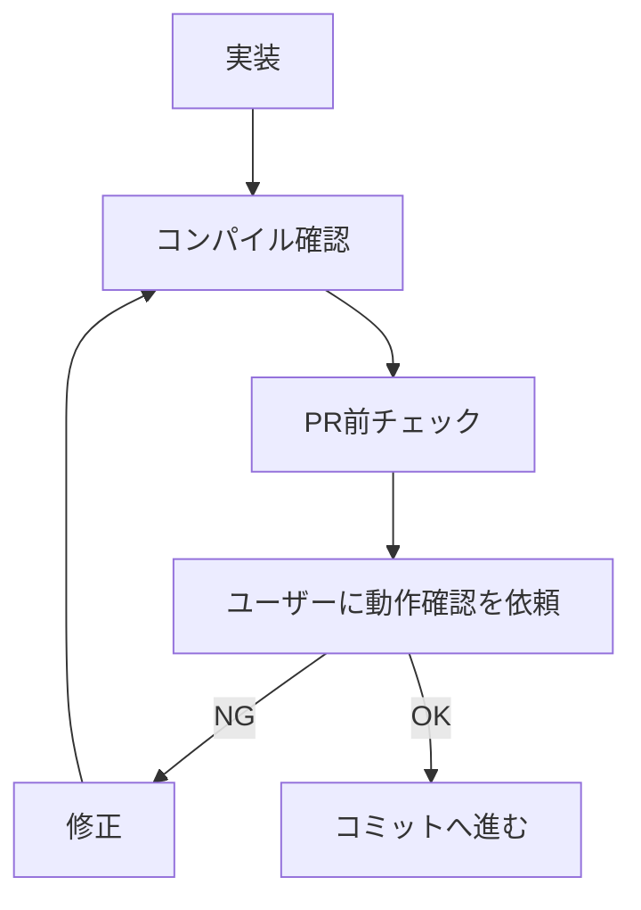

# テスト・検証方針

## 自動実行ルール

- 実装後は `rules/unity-mcp.md` の「コンパイル確認」手順で、コンパイル完了を待ってエラーがないことを確認する
- テスト実行は必ず `/test-unity` スキル経由で行う（バインディング表の「テスト実行」を直接呼ばない）

## テスト責任

Claude は実装後、ユーザーから明示されていなくても変更差分ごとにテスト要否を判断する。
**判定は層名ではなく「plain class か、Unity ランタイムに依存するか」で行う。**
報告の書き方は本ファイル「完了報告」が単一ソース（追加した場合・しなかった場合のどちらもそこに従う）。

以下の変更では、原則としてテスト追加または既存テスト更新を行う:
- Domain / Application / Shared のロジック変更
- **Presentation の plain class**（Model / Manager / Provider 等）の値域制約・導出・状態遷移・入力正規化・Clear 処理の変更
- UseCase の状態更新、rollback / fallback、呼び出し順序、キャンセル伝播の変更
- 失敗分岐のうち、**固有の**エラー変換・状態巻き戻し・副作用を持つものの変更
- Infrastructure の DTO 変換（型変換・単位変換・欠損値 fallback を含むもの）、URL / path / header 組み立て、レスポンス解釈、**外部由来**のエラーコード変換、認証情報の扱いの変更

以下の変更では、テスト不要と判断してよい:
- Presentation の見た目・配置・Inspector 配線を含む変更（ランタイム挙動はユーザー手動確認）
- View / Binder / Presenter の変更（Presenter に配線以上のロジックが入ったら、テストではなく Model への切り出しで対応する）
- コメント、XML summary、typo、ドキュメントの変更
- enum / DTO / record / struct の項目追加と、その素通しのマッピング追加
- 単一依存の失敗をそのまま転送する経路、転送のみの facade / パススルー
- context 境界をまたぐ内部 enum の再マッピング（外部由来の入力を注入する経路ではない）
- 既存テストが変更後の仕様をカバーしている変更
- Unity ランタイム、SDK、外部サービス、実機操作に依存し、手動確認のほうが適切な変更

**両方のリストに該当する変更では、下記「禁止する低品質テスト」を優先する。**
例: DTO に項目を 1 つ足して 1 対 1 でマッピングする変更は「DTO 変換」に見えるが、
書けるテストの実体は禁止リストの代入確認なので追加しない。

## 禁止する低品質テスト

以下のみを検証するテストを追加してはならない。**既存テストがこれに該当する場合は削除を提案する**
（追加時のフィルタだけでは蓄積し、しかも「既存テストで十分」判定の材料に化ける）:
- `Assert.Pass()`
- 単なる constructor / `IsNotNull` / `CreatesInstance`
- 単なる `DoesNotThrow`
- DTO / record / struct の getter / setter 代入確認だけのテスト
- データ保持型の constructor 引数が同名プロパティに入るだけのテスト
- 同型同名フィールドをコピーするだけの変換を assert するテスト（型変換・単位変換・欠損値 fallback を伴うフィールドのみ assert する）
- **スタブに仕込んだ値がそのまま返ることを確認するテスト**（SUT が転送しかしていない場合。恒等写像の確認になる）
- 初期値だけを確認し、実際の振る舞い・エラー変換・状態遷移を守らないテスト（例外は下記の初期契約）
- **外部購読される状態の初期値を、プロパティごとに 1 メソッドずつ確認するテスト**（初期契約は 1 メソッドにまとめる）
- 実装と同じ分岐をなぞるだけで仕様を表していないテスト
- エラー enum の 1 対 1 対応表を全要素列挙して写すだけのテスト
- private 実装詳細に依存した壊れやすいテスト
- 仕様語（「正しく」等）を主張するが、それを観測する assertion を持たないテスト（fake assertion）
- 下位の単体テストで既出の結果 state を、合成側のテストで再検証するだけのテスト

テストを追加する場合は、失敗時にユーザー価値・仕様・回帰リスクのいずれかを説明できる内容にする。
初期値テストは、外部から購読される状態の初期契約（購読側が初期値に依存して表示・分岐を決める）を守る場合に限り、
プロパティをまとめて 1 メソッドで検証する。

## テストスタブ

テストスタブ（Stub / Spy / Fake）は `Tests/EditMode/TestDoubles/` 配下（context 別サブフォルダ）に
共有定義する。同一 interface のスタブを各テストファイル内の private nested クラスとして
重複定義しない。

## 既知失敗テスト

外部アセット欠落等の理由で**全件実行時に常に失敗する既知のテスト**があればここに記録し、
green/red 判定はそれを除外して（またはプロジェクトのテスト assembly に限定して）行う。

- 現在: なし

## PR 前チェック

下表の該当行のチェックを実行する。いずれの行にも該当しない変更（コメント・typo・
ドキュメントのみ等）は本節のチェックを要しない。

| 変更内容 | 実行するチェック |
|:---|:---|
| **plain class** の `.cs` 変更（Domain / Application / Infrastructure / Shared、および Presentation の Model / Manager / Provider） | `/test-unity`（テスト責任の判定 + 必要なテスト追加/更新 + 実行） |
| **MonoBehaviour / UXML / シーン依存**の `.cs` 変更（View / Binder / Presenter / `*LifetimeScope`） | コンパイル確認（`rules/unity-mcp.md`）→ ユーザー動作確認 |
| 下記「lint 対象拡張子」の変更 | `/lint-unity` + コンパイル確認（`rules/unity-mcp.md`） |

複数行に該当する場合は該当するチェックをすべて実行する。

### lint 対象拡張子

`.unity` / `.prefab` / `.asset` / `.mat` / `.anim` / `.controller` / `.shader` / `.shadergraph` / `.hlsl` / `.vfx` / `.renderTexture` / `.playable` / `.asmdef` / `.png` / `.jpg` / `.tga` / `.exr` / `.wav` / `.mp3` / `.ogg`

**対象外**: `.cs` / `.uxml` / `.uss` / `.json` / `.md` / `.txt` 等。これらに対しては `/lint-unity` を起動しない。

### 実行順序

1. **`/code-review`** を実行する場合は、コードを修正しうるため最初に実行する
2. **`/test-unity`** → **`/lint-unity`** の順に実行（両スキルとも Unity MCP を使用するため逐次実行）

## ランタイム動作確認フロー

MonoBehaviour・UXML・シーンに依存する部分はランタイム挙動の自動テストが困難なため、ユーザーによる動作確認を挟む。
**自動テストの追加はこの手動確認の代替ではない。** Presentation の plain class をテストしても、
UXML 配線・レイアウト・見た目は守れないので、どちらも必要。

```mermaid
flowchart TD
    A[実装] --> B[コンパイル確認]
    B --> C[PR前チェック]
    C --> D[ユーザーに動作確認を依頼]
    D -->|NG| E[修正]
    E --> B
    D -->|OK| F[コミットへ進む]
```

- 試行錯誤中はコミットせず、ユーザーの OK 後にコミットする
- 修正中の変更は unstaged のまま重ねてよい

## 完了報告

Claude は実装完了時に以下を報告する:
- 変更した層
- テスト追加/更新の有無
- テストを追加/更新した場合: **各テストが落ちる具体的な実装改変**（どの条件式・代入をどう変えると落ちるか）
- テストを追加しない場合: なぜ不要か、既存テストで十分ならその理由
- 削除を提案した既存テストがあればその一覧と根拠（禁止リストの該当項目）
- 実行した検証（compile / `/test-unity` / `/lint-unity` / 手動確認依頼）
- 残る手動確認事項
