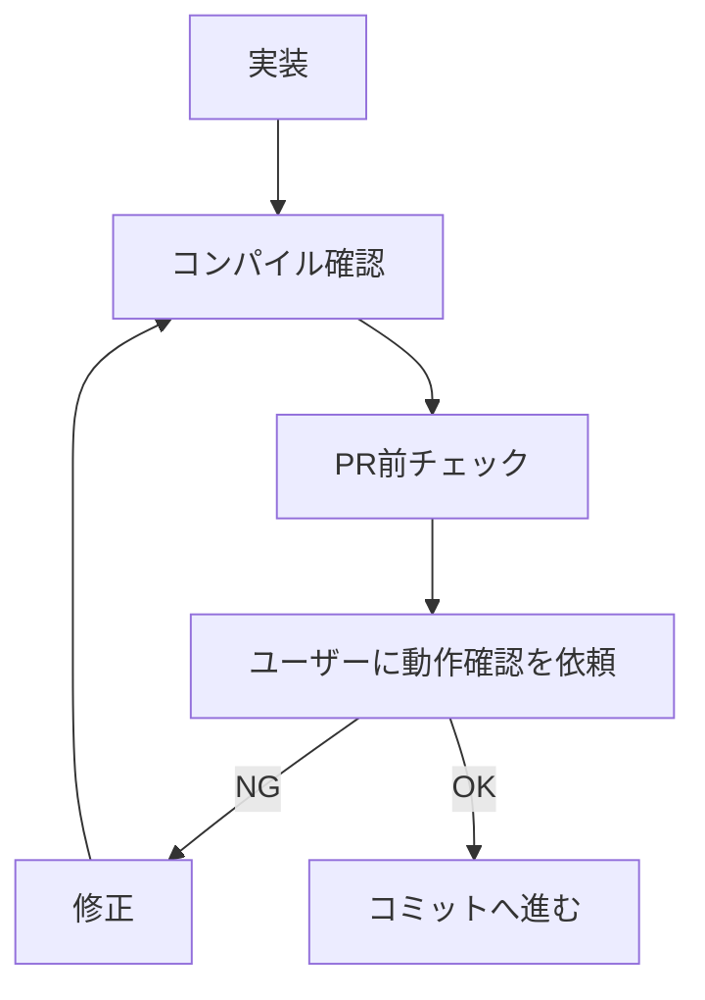

# テスト・検証方針

## 自動実行ルール

- 実装後は `rules/unity-cli.md` の「コンパイル確認」手順で、コンパイル完了を待ってエラーがないことを確認する
- テスト実行は必ず `/test-unity` スキル経由で行う（`unity test` を直接叩かない）

## テスト責任

Claude は実装後、ユーザーから明示されていなくても変更差分ごとにテスト要否を判断する。
**判定は「plain class か、Unity ランタイムに依存するか」で行う**（UI 向けのクラスでも plain class なら対象）。
報告の書き方は本ファイル「完了報告」が単一ソース（追加した場合・しなかった場合のどちらもそこに従う）。

以下の変更では、原則としてテスト追加または既存テスト更新を行う:
- plain class の純ロジック（バリデーション、計算、変換、境界条件）の変更
- 状態を持つ plain class の状態遷移、外部購読される初期値、入力正規化、Clear 処理の変更
- rollback / fallback、呼び出し順序、キャンセル伝播の変更
- 失敗分岐のうち、**固有の**エラー変換・状態巻き戻し・副作用を持つものの変更
- DTO 変換（型変換・単位変換・欠損値 fallback を含むもの）、URL / path / header 組み立て、レスポンス解釈、**外部由来**のエラーコード変換、認証情報の扱いの変更

以下の変更では、テスト不要と判断してよい:
- MonoBehaviour・シーン・UI の見た目・配置・Inspector 配線を含む変更（ランタイム挙動はユーザー手動確認）
- UXML / シーン / prefab に依存する表示反映・入力配線の変更
- コメント、XML summary、typo、ドキュメントの変更
- enum / DTO / record / struct の項目追加と、その素通しのマッピング追加
- 単一依存の失敗をそのまま転送する経路、転送のみの facade / パススルー
- 既存テストが変更後の仕様をカバーしている変更
- Unity ランタイム、SDK、外部サービス、実機操作に依存し、手動確認のほうが適切な変更

**両方のリストに該当する変更では、下記「禁止する低品質テスト」を優先する。**
例: DTO に項目を 1 つ足して 1 対 1 でマッピングする変更は「DTO 変換」に見えるが、
書けるテストの実体は禁止リストの代入確認なので追加しない。

## 禁止する低品質テスト

以下のみを検証するテストを追加してはならない。**既存テストがこれに該当する場合は削除を提案する**
（追加時のフィルタだけでは蓄積し、しかも「既存テストで十分」判定の材料に化ける）:
- `Assert.Pass()`
- 単なる constructor / `IsNotNull` / `CreatesInstance`
- 単なる `DoesNotThrow`
- DTO / record / struct の getter / setter 代入確認だけのテスト
- データ保持型の constructor 引数が同名プロパティに入るだけのテスト
- 同型同名フィールドをコピーするだけの変換を assert するテスト（型変換・単位変換・欠損値 fallback を伴うフィールドのみ assert する）
- **スタブに仕込んだ値がそのまま返ることを確認するテスト**（SUT が転送しかしていない場合。恒等写像の確認になる）
- 初期値だけを確認し、実際の振る舞い・エラー変換・状態遷移を守らないテスト（例外は下記の初期契約）
- **外部購読される状態の初期値を、プロパティごとに 1 メソッドずつ確認するテスト**（初期契約は 1 メソッドにまとめる）
- 実装と同じ分岐をなぞるだけで仕様を表していないテスト
- エラー enum の 1 対 1 対応表を全要素列挙して写すだけのテスト
- private 実装詳細に依存した壊れやすいテスト
- 仕様語（「正しく」等）を主張するが、それを観測する assertion を持たないテスト（fake assertion）
- 下位コンポーネントの単体テストで既出の結果 state を、合成クラスのテストで再検証するだけのテスト

テストを追加する場合は、失敗時にユーザー価値・仕様・回帰リスクのいずれかを説明できる内容にする。
初期値テストは、外部から購読される状態の初期契約（購読側が初期値に依存して表示・分岐を決める）を守る場合に限り、
プロパティをまとめて 1 メソッドで検証する。

## テストスタブ

テストスタブ（Stub / Spy / Fake）は `Tests/EditMode/TestDoubles/` 配下（context 別サブフォルダ）に
共有定義する。同一 interface のスタブを各テストファイル内の private nested クラスとして
重複定義しない。

## テスト実行のスコープ

`unity test --filter <パターン>` に渡す値をここに記録する。人が読んで解釈する一覧ではなく、
**コマンドへそのまま渡る値**。空なら `/test-unity` が対象から導出する（導出規則はそちらが正本）。

**この欄が古くなると、赤ではなく偽の緑が出る。** 名前空間をリネームすると `--filter` は
0 件マッチのまま exit 0 を返す。`/test-unity` は実行件数が 0 件なら停止するので、
そこで止まったらまずこの欄を疑う。

外部アセット欠落等でプロジェクト外のテストが常に失敗する場合、除外ではなく
**プロジェクト自身のテスト名前空間へ絞る**ことで避ける（`--filter` は選択であって除外ではない）。

- スコープ: なし（全件実行）

`--filter` で避けられない不安定なテストは一覧で管理しない。`unity test --retries <n>` が
リトライで通ったものを **flaky** として報告するので、その報告を根拠に対処する。

## PR 前チェック

下表の該当行のチェックを実行する。いずれの行にも該当しない変更（コメント・typo・
ドキュメントのみ等）は本節のチェックを要しない。

| 変更内容 | 実行するチェック |
|:---|:---|
| **plain class** の `.cs` 変更（ロジックを含むもの） | `/test-unity`（テスト責任の判定 + 必要なテスト追加/更新 + 実行） |
| **MonoBehaviour / UXML / シーン依存**の `.cs` 変更 | コンパイル確認（`rules/unity-cli.md`）→ ユーザー動作確認 |
| 下記「lint 対象拡張子」の変更 | `/lint-unity` + コンパイル確認（`rules/unity-cli.md`） |

複数行に該当する場合は該当するチェックをすべて実行する。

### lint 対象拡張子

`.unity` / `.prefab` / `.asset` / `.mat` / `.anim` / `.controller` / `.shader` / `.shadergraph` / `.hlsl` / `.vfx` / `.renderTexture` / `.playable` / `.asmdef` / `.png` / `.jpg` / `.tga` / `.exr` / `.wav` / `.mp3` / `.ogg`

**対象外**: `.cs` / `.uxml` / `.uss` / `.json` / `.md` / `.txt` 等。これらに対しては `/lint-unity` を起動しない。

### 実行順序

1. **`/code-review`** を実行する場合は、コードを修正しうるため最初に実行する
2. **`/test-unity`** → **`/lint-unity`** の順に実行（両スキルとも Unity Editor を使うため逐次実行）

## ランタイム動作確認フロー

MonoBehaviour・シーン・UI のランタイム挙動は自動テストが困難なため、ユーザーによる動作確認を挟む。

- 試行錯誤中はコミットせず、ユーザーの OK 後にコミットする
- 修正中の変更は unstaged のまま重ねてよい

## 完了報告

Claude は実装完了時に以下を報告する:
- 変更した箇所
- テスト追加/更新の有無
- テストを追加/更新した場合: **各テストが落ちる具体的な実装改変**（どの条件式・代入をどう変えると落ちるか）
- テストを追加しない場合: なぜ不要か、既存テストで十分ならその理由
- 削除を提案した既存テストがあればその一覧と根拠（禁止リストの該当項目）
- 実行した検証（compile / `/test-unity` / `/lint-unity` / 手動確認依頼）
- 残る手動確認事項
