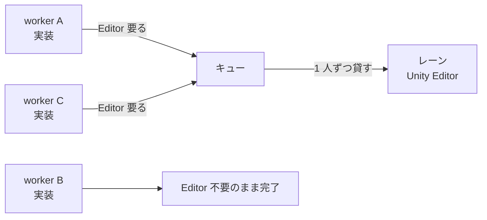

# Unity 並列作業（検証レーンの貸し出し）

**あなた（メインセッション）は coordinator に徹する。自分でコードを書かない。**

**引数**: $ARGUMENTS

## なぜこの仕組みが要るか

Unity Editor は開いているフォルダ 1 つしか見ない。そのフォルダ（＝レーン）は貸し出すたびに
`checkout --detach` で**借り手の commit へ切り替わる**ので、借りていない者がそこへ `unity command` や
`unity test` を向けると、**別のスナップショットを検証して green を報告する**。
エラーにならないので気づけない。

だから レーンは「順番に 1 人だけへ貸す排他資源」として扱う。作業自体は並列のままでよい。

> `unity test` は Editor 常駐を要さないので原理的には各 worktree で回せるが、worktree は
> `Library/` を共有しないため初回がフルインポートになり、バッチ Editor がライセンスシートを掴む。
> 3 本並列で回すより、レーンを順番に貸すほうが速い。



## 用語

- **レーン** — Unity Editor が開いたままになっているフォルダ。既定はリポジトリのルート。貸し出すときだけ `checkout --detach` で借り手の commit を指す
- **worker** — `wt-<name>/` に住むサブエージェント（`unity-worker`）。並列に何本でも
- **トークン** — レーンの貸し出し権。`lane.mjs` が 1 つだけ発行する

## 前提

- `rules/unity-cli.md` が配備済み（借り手が失敗判定・禁止事項をここから読む）
- Unity CLI が使える（`unity --version`）。レーンのプロジェクトに `com.unity.pipeline` が入っている（`unity pipeline list`）
- レーンのフォルダで Unity Editor が起動している
- Node.js が利用可能

## 手順

### Step 0: 点検

```bash
node .claude/skills/unity-parallel/lane.mjs doctor
```

未初期化なら `lane.mjs init`（レーンを別フォルダにするなら `--lane <path>`）。
**問題が報告されたら先に解消する。** 特にレーンが dirty なら貸し出しが始まらない。

### Step 1: タスク分割と worktree 作成

$ARGUMENTS を独立して進められる単位に割る。**依存関係のあるものは同じ worker に寄せる**
（別々にすると片方が相手の commit を待つだけになる）。

```bash
node .claude/skills/unity-parallel/lane.mjs add <name>
```

worktree の数は 3 本程度まで。増やしても Editor は 1 つなので、待ち行列が伸びるだけになる。

### Step 2: worker を並列起動

`unity-worker` エージェントを worktree ごとに 1 つ、**1 レスポンスにまとめて**起動する。
各 worker には最低限これを渡す:

- 担当タスク
- 自分の worktree の絶対パスと worktree 名（`lane.mjs request --worktree <name>` に要る）
- 「Editor が必要になったら commit して `lane.mjs request` を実行し、結果を返して待て」

### Step 3: 貸し出し（1 人ずつ・ここがこのスキルの本体）

worker から検証要求が返ったら、**1 サイクルを最後まで通してから次へ行く**。

```bash
node .claude/skills/unity-parallel/lane.mjs grant
```

`grant` はレーンを借り手の commit へ `checkout --detach` し、**PREPARING** で止まる。
この時点ではまだ借り手は Editor を操作できない（門番が止める）。

次に **あなたが** Editor の静止と反映を確認する:

- `unity pipeline list --format json` で Editor に到達できること（**Safe Mode でないこと**。
  Safe Mode ならコンパイルエラーが残っているので、貸し出しても借り手は何もできない）
- Play Mode でないこと、インポート・コンパイルが走っていないこと
- `rules/unity-cli.md` の「コンパイル確認」で refresh し、完了を待つ
- 「コンソールエラー取得」で切り替え前のエラーが残っていないこと

確認できたら:

```bash
node .claude/skills/unity-parallel/lane.mjs activate
```

**PREPARING のまま借り手を動かさない。** 切り替え途中に Editor を操作すると、
古いスナップショットに対する green が出る。これがこの仕組みで防ぎたい事故そのもの。

### Step 4: 借り手に Editor 作業をさせる

該当 worker へ `SendMessage` で「ACTIVE になった。Editor 作業をしてよい」と伝える。
worker は自分のコンテキストを保ったまま再開する（起動し直さない）。

検証エージェントを使う場合は、**先に権限を委譲する**:

```bash
node .claude/skills/unity-parallel/lane.mjs delegate unity-tester
# unity-tester を起動して終わったら
node .claude/skills/unity-parallel/lane.mjs undelegate
```

委譲しないと `unity-tester` は別エージェント扱いになり、門番に拒否されて止まる。

### Step 5: 返却

```bash
node .claude/skills/unity-parallel/lane.mjs drain
```

Editor 側で**シーン / Prefab Stage を保存させてから** drain する（未保存分は返らない）。

**drain の前提**: 借り手が `unity command --detach` で投げた job を**自分で** `unity job wait` して
終わらせていること（門番は ACTIVE 中の Editor 操作を借り手にしか許さないので、メインセッションが
代わりに待つことはできない）。借り手の報告に未完了の job があれば、drain せず完了を待たせる
（レーンが次の commit へ切り替わった後に走る job の結果は誰のものでもない）。

```bash
node .claude/skills/unity-parallel/lane.mjs seal -m "feat: ..."   # レーン上の成果をコミット
node .claude/skills/unity-parallel/lane.mjs return                 # worktree へ cherry-pick
```

`seal` は untracked も含めて拾う。**Editor が生成した `.meta` を取りこぼすと、worktree 側で
別の GUID が再生成されて参照が壊れる**ため。何を拾ったかは出力に出るので目を通す。

`return` は cherry-pick 後に tree の一致まで確認する。一致しなければ RECOVERY_REQUIRED になる。

戻さずに終える場合は `abandon --reason "..."`（レーン上のコミットは消さない）。

### Step 6: 次の待ち手へ

`lane.mjs status` でキューを見て Step 3 へ戻る。全部終わったら worker へ結果を伝えて続行させる。

## 守ること

- **自分でコードを書かない。** 実装は worker の仕事
- **1 サイクルを通してから次を grant する。** 並行して 2 人に貸さない（lane.mjs が拒否するが、そもそも試みない）
- **`--force` を付けて checkout しない。** レーンが dirty なら中身を確認する。Editor 側の未保存作業かもしれない
- **worker を勝手に殺さない。** 待機中の worker はコンテキストを保っている。`SendMessage` で再開する

## 詰まったとき

`lane.mjs recover` で状態を検査する。異常終了後は誰にも貸し出されない（RECOVERY_REQUIRED）。
自動では奪い返さない — Editor が中途半端な状態のまま次を載せると、原因の分からない red が出るため。

門番に拒否されたときのメッセージは、拒否理由と次にやることを含んでいる。そのまま読めばよい。

詳細（フェーズ遷移・状態ファイルの中身・門番が止められないもの）は `references/protocol.md`。

## 後片付け

```bash
node .claude/skills/unity-parallel/lane.mjs remove <name>
```

未コミットの変更や未 push のコミットがあれば削除せずに一覧を出す。**`--force` は中身を見てから**。
