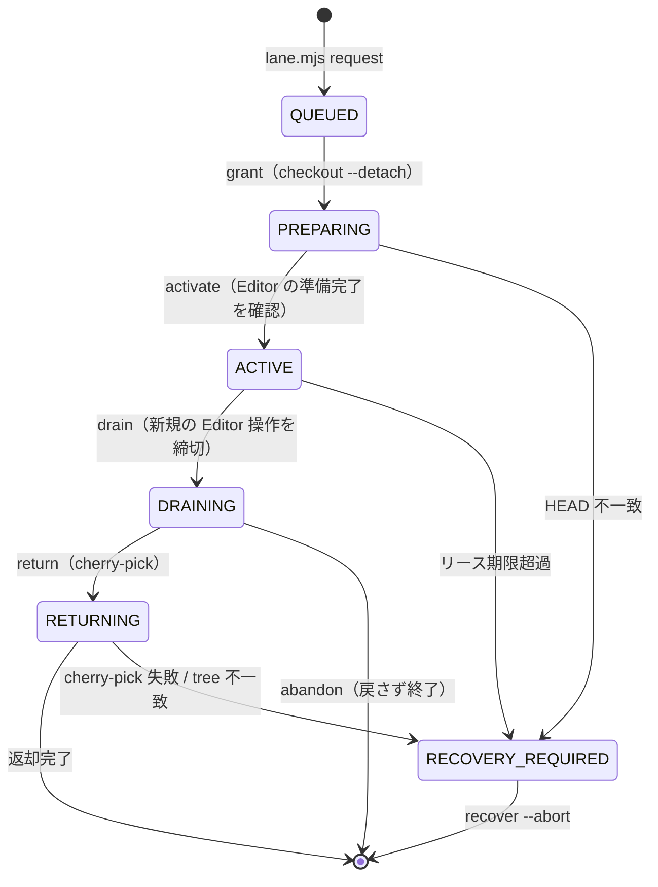

# 検証レーンのプロトコル

`SKILL.md` は手順、ここは仕組みの詳細。困ったときに読む。

## フェーズ遷移

**Editor を操作できるのは ACTIVE のときの借り手だけ。** PREPARING を許すと、checkout が終わる前の
スナップショットに対して green が出る。これがこの仕組みで防ぎたい事故の本体なので、ここは緩めない。

メインセッションは PREPARING / DRAINING / RETURNING / RECOVERY_REQUIRED のときだけ Editor を操作できる
（切り替え前の静止確認と、返却時の後始末に要るため）。ACTIVE 中は借り手のものなので触れない。

## 状態ファイル

`<git-common-dir>/unity-parallel/` に置く。**worktree ごとではなくリポジトリ共有**の場所である必要がある
（checkout で切り替わらず、どの worktree から見ても同じ実体を指すため）。

| ファイル | 中身 |
|:--|:--|
| `state.json` | 「今」の状態。保持者・キュー・承認済みスナップショット |
| `journal.jsonl` | 「何が起きたか」の追記ログ。クラッシュ後の追跡用 |
| `state.lock` | `state.json` の read-modify-write を守る短命ロック（原子的な排他生成） |
| `heartbeat` | 借り手が生きている記録。門番が毎ツール呼び出しで更新する |
| `pending-identity.json` | 門番が記録した呼び出し元の識別子（下記） |

`state.lock` が残っている＝プロセスが落ちた可能性。`lane.mjs doctor` が検出する。

## 呼び出し元の識別子はどこから来るか

サブエージェントは**自分の `agent_id` を知らない**。自己申告させると identity が意味を失うので、
`agent_id` が観測できる唯一の場所 — PreToolUse hook — で橋渡しする。

1. worker が `lane.mjs request` を Bash で呼ぶ
2. 門番がその Bash 呼び出しを見て、hook 入力の `agent_id` / `agent_type` を `pending-identity.json` へ書く
3. `lane.mjs request` がそれを読んでキューに刻み、消す（2 分で失効）

以降、門番は `state.json` の保持者 `agentId` と hook 入力の `agent_id` を突き合わせて可否を決める。

## 差分ゲート（checkout する前に見る）

`grant` で checkout してから検査したのでは、常駐 Editor が壊れたファイルを読み込んだ後になる。
よって `request` の時点で `gateBase...target` を検査する。

- **禁止**: Unity がシリアライズするファイル（`.meta` `.unity` `.prefab` `.asset` ほか）の変更
- **禁止**: `.cs` / `.asmdef` の rename・delete（`.meta` の GUID が分岐する / 旧 `.meta` が残る）
- **許可**: `.cs` / `.asmdef` の内容編集と新規追加、その他の非シリアライズファイル

`gateBase` は **前回 Editor へ載せて承認された commit**（`approvedSnapshots`）。初回だけ worktree の
base commit を使う。ここを毎回 base に戻すと、レーンで正規に作られた `.prefab` を次の要求で
違反として弾いてしまう。

禁止に当たる変更は「やってはいけない」のではなく「**Editor を借りている間に Unity CLI 経由でやる**」。
アセットの移動・削除も Editor 側の操作なら `.meta` が正しく追随する。

## `.meta` のライフサイクル

新規の `.cs` / `.asmdef` を worker が追加すると、`.meta` はレーンで Unity が生成する。
これを持ち帰り損ねると、worktree 側が**別の GUID** を再生成して既存の参照が切れる。

`lane.mjs seal` が untracked を含めてまとめて拾うのはこのため。`return` は cherry-pick 後に
tree の一致まで確認し、合わなければ RECOVERY_REQUIRED にする。

新規 `.asmdef` を **GUID 参照**する変更は 1 回の worker commit では完成しない（GUID はレーンで
初めて確定する）。名前参照を使うか、`.meta` が戻ってから 2 段目の修正を行う。

## 門番はどうやって「Editor 操作」を見分けるか

Unity 操作は `unity <サブコマンド>` に固定されているので、判定対象は **Bash / PowerShell の
コマンド文字列だけ**。ツール名だけでは Unity を触るかどうか分からない。

`protocol.mjs` の `unitySubcommands()` が、`&&` `||` `;` `|` `&` 改行で区切った各セグメントの
先頭から `unity` 呼び出しを拾い、サブコマンドを最大 2 語で返す。先頭に被さるものは剥がす:

- 環境変数代入（`UNITY_FORMAT=json unity test`）
- 制御構文（PowerShell の `if ($?) { ... }` / `foreach (...) { ... }` / call operator `& ...`）
- ラッパー（`sudo` / `env` / `timeout 600` / `nohup` / `xargs` / `Start-Process` …）
- ネストしたコマンド文字列（`sh -c 'unity test'` / `cmd /c unity test` / `Invoke-Expression`）

パス付き・空白を含むクォート済みパス・`unity.exe` / `.cmd` / `.bat` / `.ps1` も解決する。
サブコマンドは**最初のフラグより前**からしか取らない（`unity command --format json` の `json` を
サブコマンド名と読むと、カタログ一覧が Editor 操作に化ける）。

`touchesEditorViaCli()` がそれを 3 つに振り分ける:

| 分類 | 例（**抜粋**。全量は `protocol.mjs` の Set が正本） | 扱い |
|:--|:--|:--|
| 読み取り | `status` / `pipeline list` / `projects verify` / `doctor` / `editors list` / `auth status` | 借りていなくても通す |
| Editor 操作 | `command eval` / `test` / `build` / `run` / `open` / `job` / `shell` | 借り手 かつ ACTIVE のときだけ |
| 未知 | `frobnicate` / `projects clean` / `editors prune` / `license return` | **Editor 操作扱い（fail-closed）** |

**族の中で読み取りと破壊操作が同居するものは 2 語で判定する。** `editors` は `list` を通すが
`prune`（Editor をアンインストール）を止め、`license` は `status` を通すが `return`
（借り手の実行中ランを落とす）を止める。1 語で通すと族ごと素通りする。

`--help` / `-h` / `--version` は常に通す。`rules/unity-cli.md` が「フラグの正本は
`unity <command> --help`」と全員に指示しているため、ここを塞ぐと順番待ち中に何も調べられない。

読み取りを通すのは、借り手以外が状態を見られないとコーディネーターが順番待ちを判断できないため。
未知を止めるのは、CLI にサブコマンドが増えたときに**通してしまうより止めて気づかせるほうが安い**ため
（通すと偽の green が出て、しかも原因が門番だと分からない）。

サブコマンド無し（素の `unity`）は usage を出すだけなので通す。フラグしか付いていない呼び出し
（`Start-Process unity -ArgumentList ...` 等）は何をするか読めないので未知扱いで止める。

## 門番が止められないもの（正直な限界）

これは**協調的なエージェントの事故を止める仕組み**であって、意図的な回避への防壁ではない。

- **`unity` 呼び出しの取りこぼし** — コマンド文字列から `unity <サブコマンド>` を拾うヒューリスティック。
  剥がせるラッパーは上に挙げた範囲だけで、**コマンド置換**（`` `which unity` test `` / `$(command -v unity) test`）・
  **変数展開**（`$UNITY test`）・**エイリアス**・**別名でコピーしたバイナリ**・自作ラッパースクリプトは追えない
- **`unity shell` の中** — REPL に入った後のコマンドは hook を通らない（起動自体は Editor 操作として止める）
- **シェル越しの書き込み** — 同じくコマンド文字列のヒューリスティック。網羅は原理的に無理
- **hook 自体の無効化** — settings の編集、`disableAllHooks`、別プロセスの起動
- **hook を経由しない Editor 操作** — Pipeline サーバーの HTTP エンドポイントを直接叩く経路

Claude Code の hook は既定で **fail-open**（例外・不正 JSON・exit 1 はすべて「通す」）で、
`exit 2` だけがツール呼び出しを止める。よって `guard.mjs` は「判断できないなら exit 2」で書いてある。
レーンが初期化されていないときだけは素通しする（並列作業をしていないセッションを邪魔しないため）。

## この仕組みが保証しないこと

**レーンの green は、そのスナップショットに対する green でしかない。**

- 他の worker の変更と統合したときに通る保証はない（統合後の検証は別途必要）
- `Library/` を持ち回るので、クリーンな環境でのインポート結果と一致する保証はない

重要な統合点では、クリーンな `Library/` か CI での検証を最終的な権威にする。

## 復旧

`lane.mjs recover` は**自動では奪い返さない**。リース期限を超えても RECOVERY_REQUIRED にするだけで、
人が中身を見るまで次を貸さない。中途半端な Editor の状態に次のスナップショットを載せると、
原因の分からない red が出て、しかもそれが Editor 由来かコード由来か切り分けられなくなるため。

`recover --abort` は貸し出しを取り消すだけで、**ファイルは何も消さない**。レーン上のコミットも残る。
必要なら表示された `cherry-pick` コマンドで手で回収する。
