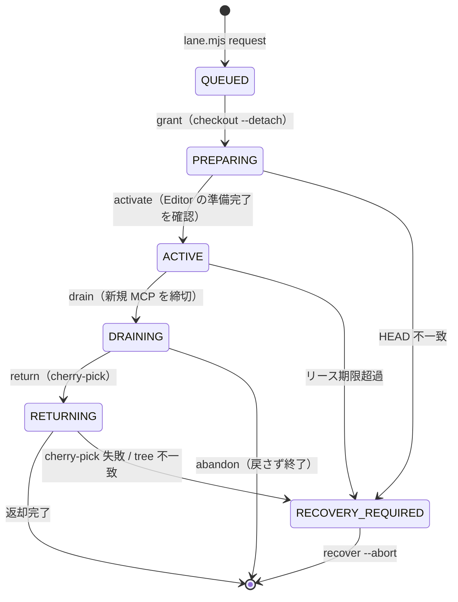

# 検証レーンのプロトコル

`SKILL.md` は手順、ここは仕組みの詳細。困ったときに読む。

## フェーズ遷移

**Unity MCP を呼べるのは ACTIVE のときの借り手だけ。** PREPARING を許すと、checkout が終わる前の
スナップショットに対して green が出る。これがこの仕組みで防ぎたい事故の本体なので、ここは緩めない。

メインセッションは PREPARING / DRAINING / RETURNING / RECOVERY_REQUIRED のときだけ Unity MCP を呼べる
（切り替え前の静止確認と、返却時の後始末に要るため）。ACTIVE 中は借り手のものなので触れない。

## 状態ファイル

`<git-common-dir>/unity-parallel/` に置く。**worktree ごとではなくリポジトリ共有**の場所である必要がある
（checkout で切り替わらず、どの worktree から見ても同じ実体を指すため）。

| ファイル | 中身 |
|:--|:--|
| `state.json` | 「今」の状態。保持者・キュー・承認済みスナップショット |
| `journal.jsonl` | 「何が起きたか」の追記ログ。クラッシュ後の追跡用 |
| `state.lock` | `state.json` の read-modify-write を守る短命ロック（原子的な排他生成） |
| `heartbeat` | 借り手が生きている記録。門番が毎ツール呼び出しで更新する |
| `pending-identity.json` | 門番が記録した呼び出し元の識別子（下記） |

`state.lock` が残っている＝プロセスが落ちた可能性。`lane.mjs doctor` が検出する。

## 呼び出し元の識別子はどこから来るか

サブエージェントは**自分の `agent_id` を知らない**。自己申告させると identity が意味を失うので、
`agent_id` が観測できる唯一の場所 — PreToolUse hook — で橋渡しする。

1. worker が `lane.mjs request` を Bash で呼ぶ
2. 門番がその Bash 呼び出しを見て、hook 入力の `agent_id` / `agent_type` を `pending-identity.json` へ書く
3. `lane.mjs request` がそれを読んでキューに刻み、消す（2 分で失効）

以降、門番は `state.json` の保持者 `agentId` と hook 入力の `agent_id` を突き合わせて可否を決める。

## 差分ゲート（checkout する前に見る）

`grant` で checkout してから検査したのでは、常駐 Editor が壊れたファイルを読み込んだ後になる。
よって `request` の時点で `gateBase...target` を検査する。

- **禁止**: Unity がシリアライズするファイル（`.meta` `.unity` `.prefab` `.asset` ほか）の変更
- **禁止**: `.cs` / `.asmdef` の rename・delete（`.meta` の GUID が分岐する / 旧 `.meta` が残る）
- **許可**: `.cs` / `.asmdef` の内容編集と新規追加、その他の非シリアライズファイル

`gateBase` は **前回 Editor へ載せて承認された commit**（`approvedSnapshots`）。初回だけ worktree の
base commit を使う。ここを毎回 base に戻すと、レーンで正規に作られた `.prefab` を次の要求で
違反として弾いてしまう。

禁止に当たる変更は「やってはいけない」のではなく「**Editor を借りている間に MCP 経由でやる**」。
アセットの移動・削除も Editor 側の操作なら `.meta` が正しく追随する。

## `.meta` のライフサイクル

新規の `.cs` / `.asmdef` を worker が追加すると、`.meta` はレーンで Unity が生成する。
これを持ち帰り損ねると、worktree 側が**別の GUID** を再生成して既存の参照が切れる。

`lane.mjs seal` が untracked を含めてまとめて拾うのはこのため。`return` は cherry-pick 後に
tree の一致まで確認し、合わなければ RECOVERY_REQUIRED にする。

新規 `.asmdef` を **GUID 参照**する変更は 1 回の worker commit では完成しない（GUID はレーンで
初めて確定する）。名前参照を使うか、`.meta` が戻ってから 2 段目の修正を行う。

## 門番が止められないもの（正直な限界）

これは**協調的なエージェントの事故を止める仕組み**であって、意図的な回避への防壁ではない。

- **シェル越しの書き込み** — コマンド文字列のヒューリスティックでしか見ていない。網羅は原理的に無理
- **hook 自体の無効化** — settings の編集、`disableAllHooks`、別プロセスの起動
- **hook を経由しない MCP 呼び出し** — Unity MCP の HTTP エンドポイントを直接叩く経路

Claude Code の hook は既定で **fail-open**（例外・不正 JSON・exit 1 はすべて「通す」）で、
`exit 2` だけがツール呼び出しを止める。よって `guard.mjs` は「判断できないなら exit 2」で書いてある。
レーンが初期化されていないときだけは素通しする（並列作業をしていないセッションを邪魔しないため）。

## この仕組みが保証しないこと

**レーンの green は、そのスナップショットに対する green でしかない。**

- 他の worker の変更と統合したときに通る保証はない（統合後の検証は別途必要）
- `Library/` を持ち回るので、クリーンな環境でのインポート結果と一致する保証はない

重要な統合点では、クリーンな `Library/` か CI での検証を最終的な権威にする。

## 復旧

`lane.mjs recover` は**自動では奪い返さない**。リース期限を超えても RECOVERY_REQUIRED にするだけで、
人が中身を見るまで次を貸さない。中途半端な Editor の状態に次のスナップショットを載せると、
原因の分からない red が出て、しかもそれが Editor 由来かコード由来か切り分けられなくなるため。

`recover --abort` は貸し出しを取り消すだけで、**ファイルは何も消さない**。レーン上のコミットも残る。
必要なら表示された `cherry-pick` コマンドで手で回収する。
